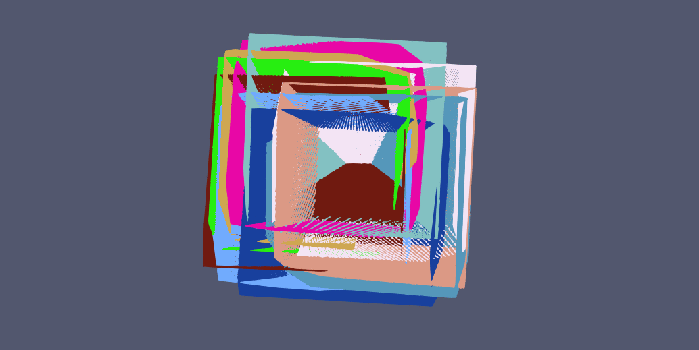
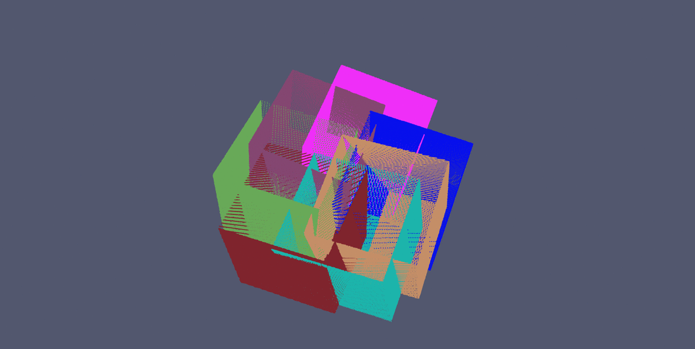

# Calibration Depth Pose

Suppose you have a depth camera rigidly attached to another sensor which gives you poses (position + orientation).
This library enables you to find the relative calibration of these two sensors.

## Synthetic Data Generator

The synthetic data generator is an interactive tool to simulate depth map acquisition by a camera. The camera is assumed to be pinhole and without noise.

This tool generates a dataset containing the following files:
  - *dataset.txt*: this is the main file which contains the path of the poses file and all the pointlcoud files
  - *dataset.poses*: this file contains the list of the camera poses (one line per capture) (qw qx qy qz x y z)
  - *pc_.ply*: point cloud files

## Calibration Example

This example shows how to use the library.
