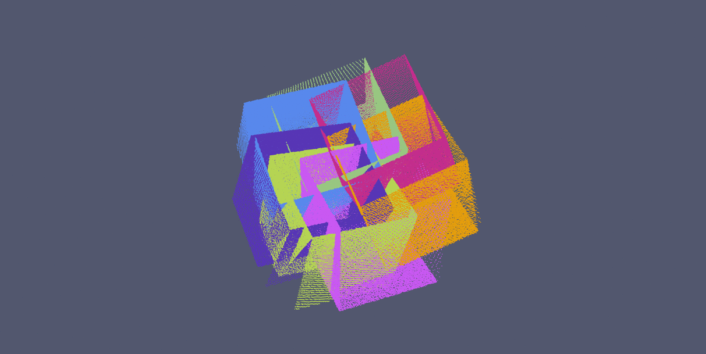
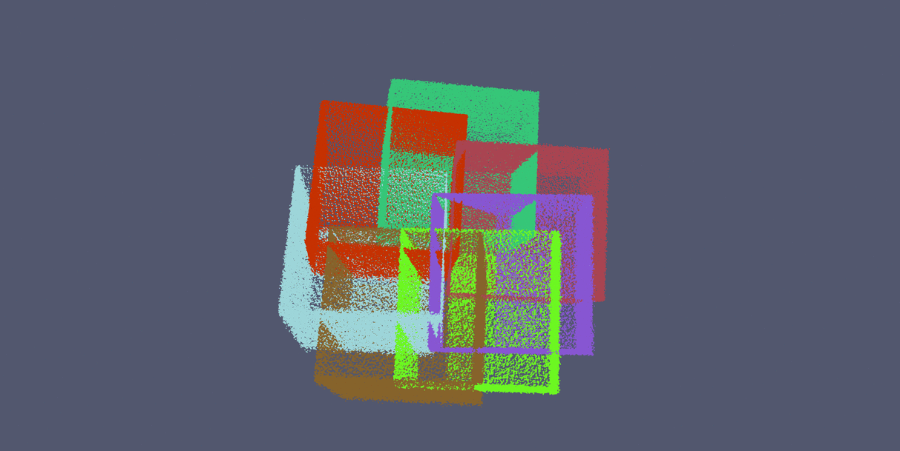
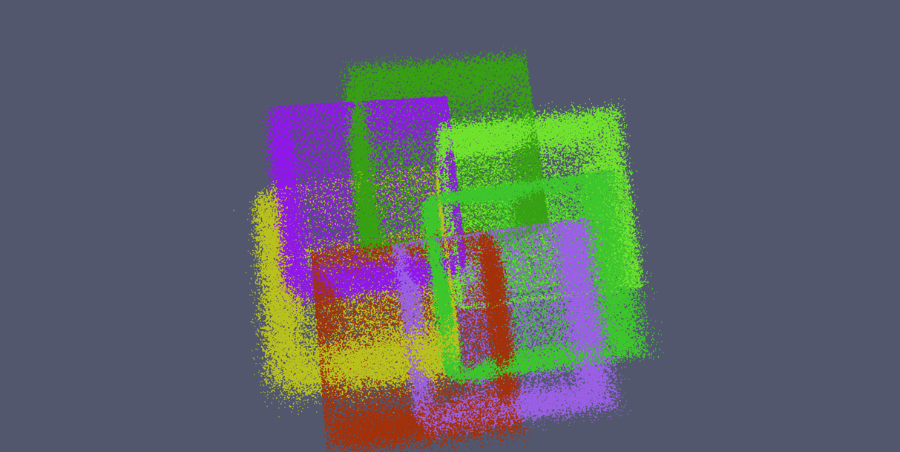
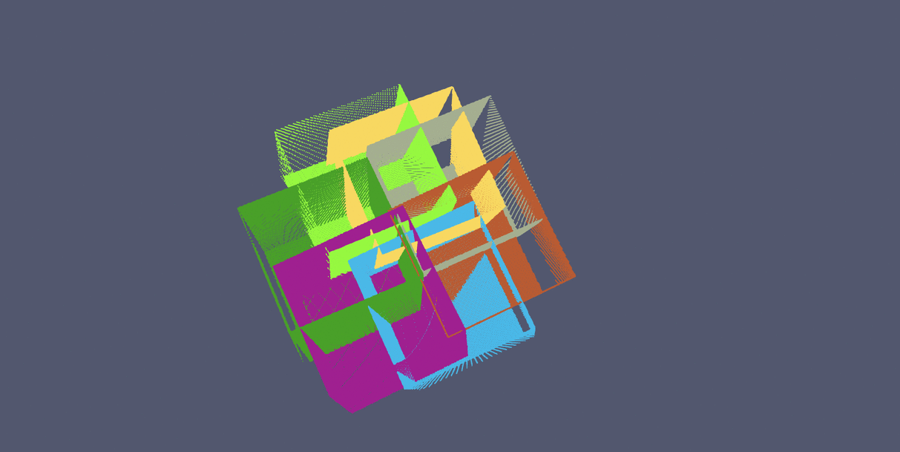
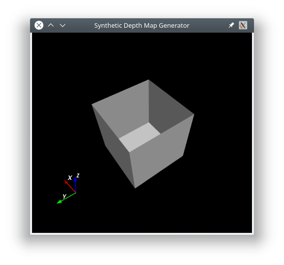

# Calibration Depth Pose

Suppose you have a depth camera rigidly attached to another sensor which gives a pose (position + orientation). This library enables you to find the relative calibration between these two sensors.

## Example of calibration convergence

|  |  |
:-------------------------:|:-------------------------:
 | 
 | 


## Dependencies
Calibration Depth Pose:
  - [Eigen3](https://github.com/eigenteam/eigen-git-mirror) (tested with 3.3.5)
  - [PCL](https://github.com/PointCloudLibrary/pcl) (tested with 1.9.1)
  - [Ceres-solver](https://github.com/ceres-solver/ceres-solver) (tested with 1.14.0)

Examples:
  - [PCL](https://github.com/PointCloudLibrary/pcl)
  - [yaml-cpp](https://github.com/jbeder/yaml-cpp)

Synthetic Data Generator:
  - [PCL](https://github.com/PointCloudLibrary/pcl)
  - [VTK](https://gitlab.kitware.com/vtk/vtk) (tested with 8.0.0)
  - [KWIVER](https://github.com/Kitware/kwiver) (Fletch is not required because only the core arrow is needed, very easy to build)

## Examples

### calibrate

This example can directly be used to process your own data. It just requires a [dataset](#dataset) and a configuration file. It also saves the concatenation of all point clouds transformed to world coordinates using the estimated calibration at each iteration.

```bash
./calibrate dataset_file calibration_parameters_file

```


The calibration parameters file contains the parameters to use for calibration. The rotation part of the initial calibration guess is expressed in Euler angles Rx Ry Rz in degrees (the rotation are compose in the same order).

Example of calibration parameters file:
~~~yaml
calibration_parameters:
  nb_iterations: 20
  calibration_initial_guess:
    rotation: [0.0, 0.0, 0.0]
    translation: [0.0, 0.0, 0.0]
  distance_type: POINT_TO_PLANE
  matching_max_distance: 0.1
  matching_plane_discriminator_threshold: 0.8
  matching_required_nb_neighbours: 10
  nb_threads: 8
pairs_matching_strategy:
  strategy: N_CONSECUTIVES_WITH_LOOP
  nb_neighbours: 1
~~~

### calibrate_synthetic_data

This example shows how to use the library and synthetic data. Like the previous example, it also saves the concatenation of all point clouds transformed to world coordinates using the estimated calibration at each iteration.


```bash
./calibrate_synthetic_data dataset_file nb_iterations noise_stddev calibrations_file

```


The calibrations file just defines the real calibration that we are looking for and the initial guess that we have.
The poses of the input dataset are transformed by the program so that they include the real calibration. This calibration is then tried to be estimated using the library algorithms. In each calibration, the rotation part is expressed in Euler angles Rx, Ry, Rz in degrees (the rotation are made in the same order).

~~~yaml
real_calibration:
  rotation: [0.2, 0.0, -0.4]
  translation: [-0.2, -0.1, 0.05]

estimated_calibration:
  rotation: [0.0, 0.0, 0.0]
  translation: [0, 0, 0]

~~~


## Synthetic Data Generator


The synthetic data generator is an interactive tool to simulate depth map acquisition by a camera. It can load a mesh in OBJ and PLY formats. The camera is assumed to be pinhole and without noise. This tool directly generates a dataset which can be used by the other tools.

```bash
./SyntheticDataGenerator mesh_file output_dir
```


### Dataset
A dataset contains the following files:
  - *dataset.txt*: this is the main file which contains the path of the poses file and all the pointlcoud files
  - *dataset.poses*: this file contains the list of the camera poses (one line per capture) (qw qx qy qz x y z)
  - *pc_.ply*: point cloud files

### Data
The *data* folder contains an example of dataset, with 7 point clouds and the associated poses. It also contains the initial mesh *box.obj* that was used to generate the synthetic data.
